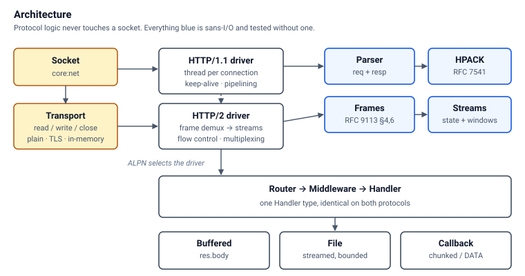
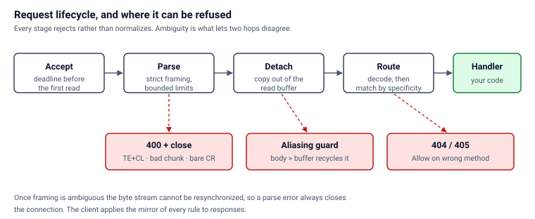

# odin-http

[](https://github.com/arcbjorn/odin-http/actions/workflows/ci.yml)

An HTTP/1.1 and HTTP/2 stack for [Odin](https://odin-lang.org), written the way
a standard library package would be: no dependencies beyond `core:`, one API for
both protocols, and correctness decisions documented where they are made.

Odin's `core:net` provides sockets and DNS; there is no HTTP above it, and
`core:net/http` is announced but unwritten. This fills that gap — server and
client, TLS with certificate verification, connection pooling, static files and
streaming — with the protocol logic kept free of I/O so it can be tested
exhaustively.

**Status:** 349 tests passing on Linux and macOS, including end-to-end coverage
over real sockets, interoperability against curl and nghttp2, and a clean
ThreadSanitizer run. Not production-hardened; see [Limits](#limits).

```odin
package main

import "core:net"
import http "path/to/http"

main :: proc() {
	router: http.Router
	http.router_init(&router)
	defer http.router_destroy(&router)

	http.router_handle_proc(&router, "GET /", proc(req: ^http.Request, res: ^http.Response) {
		http.respond_html(res, .OK, "<h1>Hello from Odin</h1>")
	})

	http.router_handle_proc(&router, "GET /greet/{name}", proc(req: ^http.Request, res: ^http.Response) {
		http.respond_plain(res, .OK, http.request_param(req, "name"))
	})

	server: http.Server
	http.server_listen(&server, {address = net.IP4_Loopback, port = 8080})
	http.server_serve(&server, http.router_handler(&router))
}
```

## Architecture



Two ideas carry most of the design.

**The protocol logic never touches a socket.** `parser_feed` takes bytes and
returns `(consumed, event)`; HPACK, h2 frames, stream state and flow control
work the same way. This is what makes it possible to test a parser one byte at a
time, to drive an entire h2 connection from a scripted byte array, and to share
one parser between the server and the client so their framing rules cannot drift
apart.

**Everything above the socket speaks bytes through a `Transport`.** TLS is a
backend behind that interface rather than a fork of the request path, which also
made an in-memory transport free — the h2 flood defences are tested by
delivering thousands of frames in a single read, which no socket-based test can
do reliably.

## Correctness



The parser rejects rather than normalizes. Nearly every request-smuggling
technique works by getting two implementations to disagree about where a message
ends, so ambiguity is refused rather than resolved:

| Input | Result |
|---|---|
| `Transfer-Encoding` + `Content-Length` | 400, close |
| Conflicting duplicate `Content-Length` | 400, close |
| `Content-Length : 5` (space before colon) | 400, close |
| Obsolete line folding | 400, close |
| `Content-Length: +5` / `0x5` | 400, close |
| Bare CR not followed by LF | 400, close |
| Unknown `Transfer-Encoding` | 400, close |
| Missing or duplicate `Host` on HTTP/1.1 | 400, close |
| Chunked trailers | parsed, never merged into headers |

Every parse error closes the connection: once framing is ambiguous the byte
stream cannot be resynchronized. On the response side, header values containing
CR or LF are rejected at the call site rather than sanitized, so response
splitting fails where it is introduced.

These verdicts were compared against Go's `net/http` on the same inputs, using
`http.ReadRequest` as an oracle. **This parser is never more permissive: it
rejects nine inputs Go accepts and accepts none that Go rejects.** Since
smuggling requires two hops to disagree about message boundaries, being strictly
less permissive than a widely deployed origin can only close attack surface. The
comparison is pinned in `tests/smuggling_test.odin` so a regression in the
permissive direction fails the suite.

Strictness is not applied where it would break legal traffic. HTTP/1.0 without a
`Host` is accepted, and an unrecognised *minor* version is treated as compatible
per RFC 9110 §2.5; only an unsupported *major* is refused.

**Borrowed strings are detached once headers are parsed.** The parser returns
slices into the read buffer, which is what makes it allocation-free — but a body
larger than the buffer forces that buffer to be recycled mid-request. Without
`request_detach`, a 20 KB upload had its target aliased to body bytes, making
the routed path attacker-controlled.

**Request targets.** All three server-side forms are handled (RFC 9112 3.2):
origin-form, absolute-form (how proxies forward), and `OPTIONS *`. The authority
in an absolute-form target is deliberately *not* used for routing — `Host` is
authoritative, and trusting the target would let a request claim any host.

**Reading input.** Path parameters, query string and urlencoded body each have an
accessor:

```odin
id   := http.request_param(req, "id")        // from "GET /users/{id}"
page := http.request_query(req)["page"]      // from "?page=2"
name := http.request_form(req)["name"]       // urlencoded request body
```

`request_form` parses `application/x-www-form-urlencoded` only. A body of any
other type yields an empty map rather than a partial parse: JSON run through a
urlencoded parser produces plausible-looking keys, which is worse than nothing.
`multipart/form-data` needs a boundary-aware reader and is not implemented.

**Basic authentication** (RFC 7617) parses and verifies in one place:

```odin
auth, ok := http.request_basic_auth(req)
if !ok || !http.basic_auth_check(auth, "ada", secret) {
	http.basic_auth_required(res, "admin area")
	return
}
```

Go leaves the comparison to the caller, and that is where it goes wrong: `==` on
a secret returns at the first mismatched byte, leaking how many leading bytes
were correct. `basic_auth_check` uses `crypto.compare_constant_time`. Since no
functional test can tell the two apart, the suite asserts the implementation
itself, so swapping in `==` fails.

## Handlers

Odin has no interfaces, so Go's `http.Handler` becomes an explicit closure — a
proc pointer plus its data, which is what a Go interface value is at runtime.

```odin
h := http.handler_from_proc(proc(req: ^http.Request, res: ^http.Response) {
	http.respond_plain(res, .OK, "hi")
})

// With typed state; the cast lives in the library, not your handler.
counter := Counter{}
h := http.handler_from_poly(&counter, proc(c: ^Counter, req: ^http.Request, res: ^http.Response) {
	sync.atomic_add(&c.hits, 1)
})

// Middleware wraps another handler and decides whether to call it.
auth := http.middleware(&inner, proc(h: ^http.Handler, req: ^http.Request, res: ^http.Response) {
	if _, ok := http.headers_get(req.headers, "authorization"); !ok {
		http.respond_status(res, .Unauthorized)
		return
	}
	http.handler_serve(h.next, req, res)
})
```

Handler state is shared across connections and handlers run concurrently, so
mutation must be synchronized. A plain `c.hits += 1` measured **4799 of 4800**
increments under load — rare enough to pass casual testing, wrong in production.

**Routing** follows Go 1.22's `ServeMux`: `GET /users/{id}` and
`GET /static/{path...}`. Matching is by specificity rather than registration
order, so `/users/me` beats `/users/{id}` regardless of source order. A path
that matches under a different method returns 405 with `Allow`, not 404.

## Responses

Three body kinds, all working identically on HTTP/1.1 and HTTP/2:

```odin
http.respond_plain(res, .OK, "buffered")          // res.body

http.response_set_file(res, handle, offset, size) // streamed from disk

http.response_set_stream(res, &feed, proc(w: ^http.Stream_Writer, f: ^Feed) {
	for row in f.rows { http.stream_write_string(w, row) }
})
```

**Bodies stream; they are not buffered.** Reading a file whole costs one copy of
it per concurrent request. Measured on a 200 MB file: **207 MB RSS buffered vs
1.8 MB streamed**, byte-identical output. `file_chunk_size` (64 KiB) bounds peak
memory regardless of file size.

Chunk framing belongs to the transport, not the handler. HTTP/1.1 wraps each
write in a size header and CRLF; HTTP/2 does not, because DATA frames already
delimit themselves. Handlers are written once and are correct on both.

## Static files

```odin
fs := http.DEFAULT_FILE_SERVER
fs.root = "./public"
http.router_handle(&router, "GET /static/{path...}", http.file_server_handler(&fs))
```

Serves with `Content-Type` by extension, `ETag`, `Last-Modified`,
`Cache-Control` and `X-Content-Type-Options: nosniff`. Honours `If-None-Match`
(including `*` and weak comparison), `If-Modified-Since`, and `Range` —
`bytes=2-5`, `bytes=4-`, `bytes=-3` — returning 206 with `Content-Range`.
`If-Range` is honoured, so a stale validator serves the whole file rather than a
range of content the client never saw.

Path handling is layered, because this is where file servers get exploited:

1. The router percent-decodes before matching.
2. Bytes dangerous in any position are rejected: NUL (truncates paths in C APIs)
   and backslash (a separator on Windows).
3. The path is lexically cleaned, resolving `.` and `..` without touching the
   filesystem, so it cannot be raced or redirected through a symlink.
4. A `..` that would escape the root is **refused**, not clamped. Clamping is
   safe but silently serves a different file; a 404 makes the attempt visible.

Verified against `../secret`, `%2e%2e%2f`, `..%2f`, `....//` and raw
socket-level traversal — all 404. An unknown extension falls back to
`application/octet-stream` rather than sniffing, since guessing `text/html` on
user data is stored XSS. Directory listing is not implemented.

## Cookies

```odin
http.response_set_cookie(res, http.cookie_session("sid", token))  // Secure, HttpOnly, SameSite=Lax
sid, ok := http.request_cookie(req, "sid")
http.response_delete_cookie(res, "sid")
```

`Set-Cookie` is emitted once per cookie, never joined — an `Expires` date
contains a comma, so a joined value is ambiguous. Values are validated rather
than escaped: a cookie carrying `; HttpOnly`, a comma, a backslash or CRLF is
rejected at the call site instead of forging an attribute. `SameSite=None`
without `Secure` is refused, since browsers silently drop it.

## HTTP/2

Negotiated over ALPN on the same port as HTTP/1.1, with automatic fallback:

```
curl --http2   https://127.0.0.1:8443/   ->  version=2   status=200
curl --http1.1 https://127.0.0.1:8443/   ->  version=1.1 status=200
```

Ten parallel requests multiplex over a single connection (`num_connects=1`). A
500 KB upload arrives with a checksum identical to the HTTP/1.1 path, which is
only possible if flow-control windows are replenished — the initial window is
65535 bytes.

Flow control is enforced in both directions. Against a client advertising a
16384-byte stream window, a 1 MB response stops at exactly 16384 bytes and
resumes on WINDOW_UPDATE; curl needs no such stall because it opens with a 10 MB
window, which is why the case is pinned by a test rather than by curl alone.

Each layer was built sans-I/O and validated independently:

| Layer | Validated against |
|---|---|
| Frames | Hand-written wire bytes, plus real `curl --http2` traffic |
| HPACK | RFC 7541 Appendix C examples, plus a real curl header block |
| Streams, flow control | RFC 9113 §5.1 and §6.9 rules directly |
| Request validation | RFC 9113 §8.1–8.3 pseudo-header rules |

Round-trip tests only prove an encoder and decoder agree with each other, so the
decoders are checked against nghttp2's output instead.

### Semantics carried over from HTTP/1.1

Feature parity is asserted rather than assumed — three separate audits found
features that silently degraded over h2 while still producing well-formed
frames. `Cookie` is rejoined with `"; "` rather than `", "`, since RFC 9113
8.2.3 lets clients split it and the ordinary join produces a string no parser
can read. Trailers are accepted, because a second HEADERS frame carries them
rather than reopening the stream — treating it otherwise killed every gRPC call.
`HEAD` reports the `Content-Length` the equivalent GET would.

### Smuggling and flood resistance

Request validation is HTTP/2's smuggling defence: an h2-to-HTTP/1.1 gateway that
forwards a `transfer-encoding` accepted here turns it into a framing header
downstream. So connection-specific headers (RFC 9113 8.2.2) are rejected rather
than dropped, uppercase field names are malformed rather than folded, and
pseudo-headers after a regular field are refused.

| Attack | Defence |
|---|---|
| **Rapid Reset** (CVE-2023-44487) | Closed streams are reaped past a bound. Open-then-reset never trips `max_concurrent`, so retaining them all grows memory without limit. |
| **Ping flood** (CVE-2019-9512) | Acknowledgement-demanding frames are counted per read batch; past the bound the connection gets `ENHANCE_YOUR_CALM`. |
| **Settings flood** (CVE-2019-9515) | Same counter — SETTINGS also obliges a reply. |
| **Header interleaving** | Any frame between HEADERS and its final CONTINUATION is a connection error; interleaving desynchronizes HPACK. |
| **Priority churn** (CVE-2019-9513) | PRIORITY is accepted and ignored, so there is no state to churn. |

Fifteen malformed-frame cases assert the *correct* error code, not merely that
the server survives: a peer probing an implementation learns from which
malformed frames are tolerated.

**Handlers run serially per connection**, so a slow one head-of-line blocks the
other streams on it. `Handler` is synchronous, and running one per stream would
require serializing writes from many threads back onto one socket. h2 still wins
on connection reuse and header compression.

Not implemented: server push, CONNECT, priority signalling, and h2c over
cleartext.

## Client

```odin
arena: virtual.Arena
virtual.arena_init_growing(&arena)
defer virtual.arena_destroy(&arena)

c := http.DEFAULT_CLIENT
res, err := http.client_get(&c, "https://example.com/", virtual.arena_allocator(&arena))
```

The response borrows from the arena, so one destroy frees everything. The client
shares the parser with the server, so `Parse_Role` selects the first-line grammar
and everything else — chunked decoding, header validation, the smuggling
defences — is the same code.

**Certificates are verified, with no flag to disable it.** Chain validation
against the system trust store, hostname matching via `SSL_set1_host`, and SNI
are all mandatory. Verified against `badssl.com`: `expired`, `wrong.host`,
`self-signed` and `untrusted-root` all fail; `sha256` succeeds. To talk to a
self-signed development server, add its certificate to a trust store — an
insecure mode reliably ends up in production.

CI enforces this: `scripts/check_tls.sh` points the client at a self-signed
server and fails unless the handshake is refused. Verification is applied twice —
`SSL_VERIFY_PEER` and an explicit `SSL_get_verify_result` — so removing either
alone changes nothing observable; the check catches the case where both are gone,
which is what "TLS verification was turned off" actually looks like.

Redirects are followed up to `max_redirects` (5), with two rules browsers and
curl both enforce: an https-to-http redirect fails with `.Insecure_Redirect`
rather than silently dropping TLS, and `Authorization`, `Proxy-Authorization`
and `Cookie` are stripped when the redirect crosses an origin. Same-origin
redirects keep them, so ordinary authenticated flows still work.

### Connection pooling

Opening a connection dominates the cost of a small request. Five sequential
HTTPS requests to the same origin, with and without a pool:

| | Per request |
|---|---|
| HTTPS, no pool | 112.7 ms |
| HTTPS, pooled | **9.4 ms** |

The absolute numbers depend on the network path; the ratio is the point. Nearly
all of the difference is the TLS handshake, which a pooled connection pays once
instead of per request.

```odin
pool: http.Pool
http.pool_init(&pool)
defer http.pool_destroy(&pool)

c := http.DEFAULT_CLIENT
c.pool = &pool
```

Keyed by origin — scheme, host *and* port — so a connection to
`https://example.com` is never handed out for `http://example.com`. Bounded by
`max_idle` (32) and `idle_timeout` (60 s), evicting oldest-first.

A pooled connection may have been closed by the peer while idle, which surfaces
only on the next read; the client retries once on a fresh connection. Only a
*reused* connection earns the retry, since retrying one just opened would double
every genuine failure.

**A pooled connection carrying unread bytes is retired, not reused.** This client
does not pipeline, so anything the peer sends beyond the response was never asked
for, and reusing that connection would let those bytes become the next response —
a forged reply the caller cannot distinguish from a real one. The check runs when
a connection is taken from the pool as well as when it is returned, because a
peer can send the extra bytes after the connection has already gone idle.

## TLS

```odin
tls: http.TLS_Config
http.tls_config_init(&tls, "cert.pem", "key.pem")
defer http.tls_config_destroy(&tls)

opts := http.DEFAULT_SERVER_OPTS
opts.tls = &tls
http.server_listen(&server, {address = net.IP4_Loopback, port = 8443}, opts)
```

TLS is a `Transport` backend, not a fork of the request path — the shape the Odin
core team stated for TLS, since a native implementation is estimated at "a man
year's worth of work to do well". The OpenSSL backend here satisfies that
interface; a pure-Odin stack or SChannel would satisfy the same one.

Verified: **TLSv1.3 / TLS_AES_256_GCM_SHA384**, keep-alive across requests, TLS
1.1 refused (1.2 is the enforced minimum per RFC 8996), and plain HTTP to the TLS
port refused. A failed handshake is logged at debug, since it is
attacker-triggerable and must not flood the log.

Handshakes are bounded before they start. `SSL_accept` and `SSL_connect` both
read from the peer, and `read_timeout` only applies once a connection is usable:
unbounded, `max_connections` silent sockets took the server offline permanently,
and a mute server hung the client indefinitely.

On macOS the library is linked by path, since Apple removed libssl from the
system; Linux resolves `system:ssl` normally.

## Concurrency

One OS thread per connection. Handler code is straight-line, a request's lifetime
is its stack frame, and a blocking handler affects only its own connection.

No throughput figure is quoted here. Measuring one honestly needs a load
generator on separate hardware: driving connection-per-request load from the
same machine exhausts the ephemeral port range within seconds, and repeated runs
of an identical configuration varied by 8x (1,575 to 12,881 req/s) purely from
TIME_WAIT accumulation. A number produced that way says more about the harness
than the server.

Nothing that reads from a peer runs on the accept thread, and connection threads
use `self_cleanup` — `thread.destroy` *joins*, so calling it in the accept loop
would block that loop for the life of the connection.

The suite runs under ThreadSanitizer in CI and reports **no data races in the
library**. TSan only sees contention that actually happens, so the suite drives
eight concurrent connections through one server and hammers the Date cache from
eight threads — otherwise the hottest shared paths are never observed under
contention at all.

That distinction is not theoretical. Deleting the Date cache mutex is invisible
to the rest of the suite: TSan reports a clean run. The contention test catches
it immediately, and the same holds for the active-connection counter. Each guard
was verified this way — remove the lock, confirm TSan reports the race and exits
non-zero, restore it.

`server_shutdown` stops the accept loop; `server_serve` then drains in-flight
connections before returning, since connection threads are detached and would
otherwise dereference a `Server` the caller may have freed. `shutdown_timeout`
bounds the wait.

**Panics.** Odin has no `recover` — `Assertion_Failure_Proc` returns `!` — so a
handler panic terminates the process. That cannot be fixed at the library level,
but the diagnosis can: each connection installs a handler that names the request
first.

```
main.odin(13:3) panic: handler exploded
  while serving: GET /boom from Endpoint{address = [127, 0, 0, 1], port = 61396}
```

### Why not an event loop

The sans-I/O parser was written so a `core:nbio` driver could reuse it. Measuring
the premise showed it does not pay.

Parse and serialize with no I/O — the protocol work an event loop would keep —
costs **1.5-2.6 µs** per request (200,000 iterations, `-o:speed`, arena reset
between requests). Thread spawn and join measures 27-92 µs depending on whether
threads are joined in batches or self-cleaned, which is an order of magnitude
more. Protocol work is the small term; syscalls and scheduling dominate, and an
event loop reshapes those rather than removing them. With keep-alive a thread is
created per *connection*, so even that cost amortizes away.

The deeper problem is the API. `Handler` is synchronous, and on an event loop one
blocking database call stalls every connection sharing that thread. Fixing that
needs either a second non-blocking `Handler` type or a worker pool — a thread hop
per request, reintroducing the cost the loop was meant to remove.

## Testing

```sh
odin test tests
odin run examples/hello
```

Three levels, catching different bugs. A `Recorder` runs a handler with no
sockets:

```odin
rec: http.Recorder
http.recorder_init(&rec, .Get, "/users/42")
defer http.recorder_destroy(&rec)

http.recorder_serve(&rec, &handler)
assert(http.recorder_status(&rec) == .OK)
```

A `Test_Server` binds an ephemeral loopback port and runs the real accept loop,
which is the only way to cover framing, keep-alive and pipelining:

```odin
ts: http.Test_Server
http.test_server_start(&ts, handler)
defer http.test_server_stop(&ts)

resp, _ := http.test_request_raw(ts.endpoint, "GET /hello HTTP/1.1\r\nHost: x\r\n\r\n")
```

A `Memory_Transport` drives a connection loop from a scripted byte array, which
is how the h2 protocol and flood tests deliver inputs no real client would send.

The raw-bytes client is deliberate: asserting on exact wire output requires
sending malformed input a well-behaved client could not produce.

A fourth level fuzzes the pure parsers. Seeds are near-valid strings and the
mutations are grammar-aware — truncations and spliced fragments such as a bare
`%` or a leading CR — because uniformly random bytes essentially never place a
truncated escape one byte from the end of a string. It runs 40,000 cases in
under 100 ms with a fixed seed, so a failure reproduces.

Both fuzzers were validated by reintroducing real bugs and confirming they fail.
One was a buffer overrun in `percent_decode`, which sized its output as
`len(s) - count*2` on the assumption that every `%` began a complete escape;
`GET /ab% HTTP/1.1` was enough to crash the connection thread. The other was a
removed bounds guard in the line scanner. That second one initially escaped
detection, because every seed began with a method name and no mutation prepends
a terminator; the seed list now covers it.

Each fix in this repository is verified the same way — the fix is reverted, the
test must fail, and only then is it kept.

## Limits

- Server push, CONNECT and h2c are not implemented.
- `multipart/form-data` is not parsed; urlencoded bodies and query strings are.
- h2 handlers run serially per connection.
- The client is HTTP/1.1 only; it does not offer ALPN, so h2-preferring servers
  correctly fall back.
- One OS thread per connection caps concurrency in the low thousands.
- TLS requires OpenSSL 3.x, so it is available on Linux and macOS only.
  Elsewhere plaintext HTTP works and every TLS entry point fails at setup
  rather than at handshake time. A Windows backend would wrap SChannel behind
  the same `Transport` interface.
- Not audited by anyone but its tests.

## License

MIT
